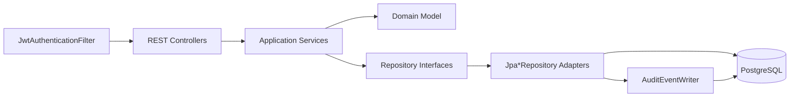
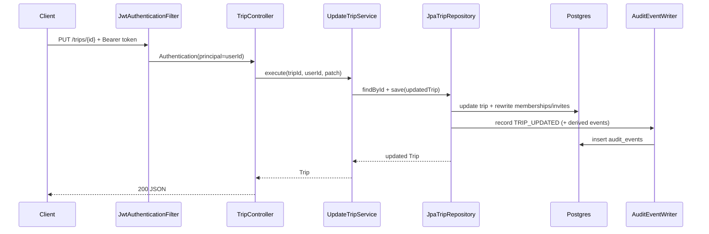

# Backend Architecture and Critical Code Review

## Document Metadata
- Status: Active architecture review baseline
- Reviewed on: 2026-02-22
- Scope: Backend (`backend/**`)

## Scope
- Codebase reviewed: `backend/src/main/kotlin/com/travelcompanion/**`, `backend/src/test/kotlin/com/travelcompanion/**`, and backend migrations/config.
- Baseline verification: `cd backend && ./gradlew test` (passing at review time).

## System Walkthrough
The backend is organized in four layers:
- `domain/`: aggregates (`Trip`, `Expense`, `User`), value objects (`TripId`, `UserId`, `ExpenseId`), repository ports.
- `application/`: use-case services (trip CRUD, itinerary/collaboration flows, auth/register/login, expenses).
- `infrastructure/`: JPA repositories, Spring Data repositories, JWT auth filter/service, audit writers/query.
- `interfaces/rest/`: HTTP controllers, DTOs, exception mapping.

### High-Level Component Diagram

### Runtime Request Flow (Trip Update)

## Critical Findings (Be Very Critical)

### 1) JWT cookie authentication is effectively broken
- File: `backend/src/main/kotlin/com/travelcompanion/infrastructure/auth/JwtAuthenticationFilter.kt`
- Method: `extractToken`
- Problem: cookie lookup result is not returned; function always returns `null` unless header is set.
- Impact: cookie-based auth path silently does not work; misleading config and potential prod auth incident.
- Severity: `high`

### 2) Owner transfer can desync domain vs database owner field
- File: `backend/src/main/kotlin/com/travelcompanion/infrastructure/persistence/TripJpaEntity.kt`
- Problem: `ownerId` is marked `updatable = false`.
- File: `backend/src/main/kotlin/com/travelcompanion/domain/trip/Trip.kt`
- Method: `leaveTrip` can change `userId` (primary owner transfer).
- Combined impact: aggregate may transfer owner, but DB `trips.owner_id` might not update.
- Severity: `high`
- Side-effect: delete authorization uses `existsByIdAndOwnerId`, which may reject legitimate new owners.

### 3) Aggregate persistence strategy rewrites whole child collections
- File: `backend/src/main/kotlin/com/travelcompanion/infrastructure/persistence/JpaTripRepository.kt`
- Problem: every `save` does `deleteByTripId` + reinsert all memberships/invites.
- Risks:
  - temporal metadata loss semantics (`createdAt` rewritten for memberships),
  - unnecessary write amplification,
  - race-condition windows in concurrent updates,
  - invite IDs regenerated each save (no stable identity).
- Severity: `high`

### 4) N+1 query pattern while hydrating trips
- File: `backend/src/main/kotlin/com/travelcompanion/infrastructure/persistence/JpaTripRepository.kt`
- Problem: `findByUserId` / `findByInviteEmail` fetch trip list, then `toDomain` loads memberships and invites per trip via separate repositories.
- Impact: query count grows with list size; avoidable latency.
- Severity: `medium`

### 5) Authorization semantics are inconsistent (404 vs 403)
- Examples:
  - `ItineraryV2Service` returns `null` for both not found and forbidden.
  - `TripCollaboratorController.getCollaborators` uses explicit `existsTrip` to separate 404/403.
- Impact: inconsistent API contract, harder client behavior and security observability.
- Severity: `medium`

### 6) REST path invariant violation in expense update/delete
- File: `backend/src/main/kotlin/com/travelcompanion/interfaces/rest/ExpenseController.kt`
- Problem: `tripId` path var is ignored in update/delete; only `expenseId` is used.
- Impact: endpoint allows updating/deleting an expense through mismatched trip URL, violating resource semantics.
- Severity: `medium`

### 7) Controller-level repeated auth parsing and mapping logic
- Files:
  - `backend/src/main/kotlin/com/travelcompanion/interfaces/rest/TripController.kt`
  - `backend/src/main/kotlin/com/travelcompanion/interfaces/rest/ItineraryController.kt`
  - `backend/src/main/kotlin/com/travelcompanion/interfaces/rest/ExpenseController.kt`
  - `backend/src/main/kotlin/com/travelcompanion/interfaces/rest/TripCollaboratorController.kt`
- Problem: repeated `requireUserId/resolveUserId`, repeated domain->DTO conversion patterns.
- Impact: duplication, drift risk, wider bug surface.
- Severity: `medium`

### 8) Integration tests parse JSON with regex repeatedly
- Files: integration tests across controllers.
- Problem: repeated regex extractors for `token/id`.
- Impact: brittle tests and duplicated helpers; difficult to evolve payload shape.
- Severity: `low`

## Repeated Code That Should Become Common Components

### A) Auth principal extraction
- Create `interfaces/rest/support/AuthPrincipalResolver`:
  - `fun requireUserId(authentication: Authentication?): UserId?`
- Replace controller-local helpers.

### B) Trip lookup + access guard pattern
- Create reusable application guard:
  - `TripAccessService.loadReadableTrip(tripId, userId)`
  - `TripAccessService.loadWritableTrip(tripId, userId)`
  - return typed error (`NOT_FOUND`, `FORBIDDEN`) instead of `null`.

### C) Integration-test fixture toolkit
- Add `backend/src/test/kotlin/com/travelcompanion/support/ApiTestFixture.kt`:
  - register/login helpers
  - createTrip helper
  - JSON parsing using Jackson (`ObjectMapper`) not regex

### D) DTO mapping consolidation
- Add mapper object(s) per bounded context:
  - `TripResponseMapper`
  - `CollaboratorResponseMapper`
  - `ExpenseResponseMapper`

## Unused / Likely Dead Code
- `backend/src/main/kotlin/com/travelcompanion/infrastructure/auth/JwtService.kt`
  - `getUserIdFromToken` has no call sites in repository.
  - Candidate for deletion unless planned external use.

## Test Matrix (Current + Missing)

Legend:
- `Y`: covered now
- `N`: missing
- `P`: partial

| Component | Unit Tests | Integration Tests | Key Missing Scenarios |
|---|---|---|---|
| `Trip` aggregate | Y (`TripTest`) | Indirect | Property-style invariants for reorder/move combinations; mutation fuzz tests |
| `ItineraryItem` | Y | Indirect | Edge values for lat/lng boundary + malformed updates via service path |
| `Expense` domain | N | Indirect | Negative amount, blank currency, normalization guarantees |
| `GetTripService` | Y | Y (`TripControllerIntegrationTest`) | Distinguish forbidden/not-found contract |
| `CreateTripService` | N | Y | Visibility and default-membership invariants in unit scope |
| `DeleteTripService` | N | Y | Owner transfer + delete authorization consistency |
| `GetTripsService` | N | Y | Membership-only access list behavior and ordering |
| `ItineraryV2Service` | Y | Y | Invalid itemId/day transitions + permission matrix |
| `UpdateTripService` | Y | Y | All combinations of owner/editor/viewer for core vs visibility edit |
| `ManageTripMembershipService` | Y | Y | Invite idempotency, role transitions matrix, ownership transfer end-to-end |
| `LinkPendingInvitesOnRegistrationService` | Y | Indirect | Multi-trip invite linkage + duplicate email casing |
| Expense services | Y | Y | `tripId`/`expenseId` mismatch contract (controller integration) |
| Auth services (`Register`, `Login`) | P (`Register` only) | Y | Missing dedicated `LoginService` unit tests for normalization/invalid paths |
| `JpaTripRepository` | P (`JpaTripRepositoryAuditTest`) | Indirect | owner transfer persistence, no-N+1 expectation, concurrent membership updates |
| `JpaUserRepository` | N | Indirect | audit redaction and case-insensitive lookup semantics |
| `JpaExpenseRepository` | N | Indirect | audit lifecycle (create/update/delete) integrity |
| `JwtAuthenticationFilter` | N | Indirect | cookie extraction path, invalid token behavior, principal propagation |
| `AuditQueryService` | N | Y (`AuditControllerIntegrationTest`) | limit clamping, combined filters, actor filter happy path |
| All controllers | P | Y | standardized 401/403/404 contract; validation error shape consistency |

## Recommended Test Expansion Plan

### Unit (priority order)
1. `JwtAuthenticationFilterTest`:
   - header token, cookie token, invalid token, existing context bypass.
2. `LoginServiceTest`:
   - normalized email, wrong password, unknown user.
3. `CreateTripServiceTest` / `DeleteTripServiceTest` / `GetTripsServiceTest`.
4. Repository adapter tests:
   - `JpaExpenseRepositoryTest`, `JpaUserRepositoryTest`, expand `JpaTripRepositoryAuditTest`.

### Integration (controller + persistence invariants)
1. Expense route invariant:
   - `/trips/{A}/expenses/{expenseOfB}` should fail with `404`/`400`.
2. Ownership transfer:
   - primary owner leaves with successor, then successor can delete trip.
3. Auth cookie flow:
   - call secured endpoint with access token cookie only.
4. Contract consistency:
   - matrix for forbidden vs not-found across trips/collaboration/itinerary endpoints.

## Other Enhancement Opportunities
- Introduce explicit result types from application services (`sealed class`) instead of nullable return for business decisions.
- Separate command and query models for itinerary read projection; current aggregate methods combine mutation + UI shape concerns.
- Add static analysis:
  - Detekt + Ktlint + dependency cycle checks.
- Add mutation or property-based testing for `Trip.moveItineraryItem` complexity.
- Add architecture tests (ArchUnit/Konsist) enforcing layer boundaries.

## Suggested Refactor Backlog (Prioritized)
1. Fix JWT cookie extraction and add filter unit tests.
2. Fix owner transfer persistence (`owner_id` update path) and add integration test.
3. Replace full child-collection rewrite strategy with differential updates.
4. Introduce shared auth resolver + DTO mappers.
5. Standardize error model and forbidden/not-found semantics.
6. Build shared integration fixture to remove regex JSON parsing duplication.
