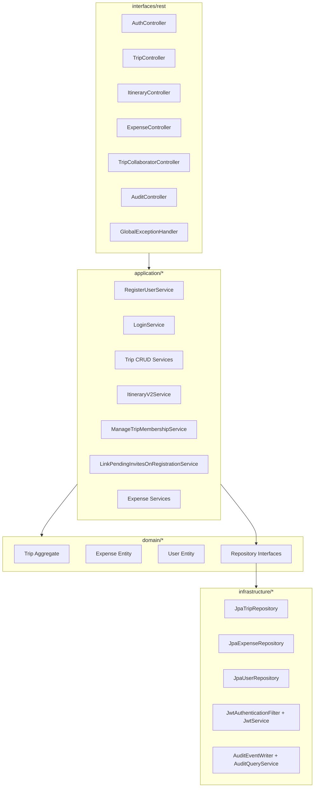
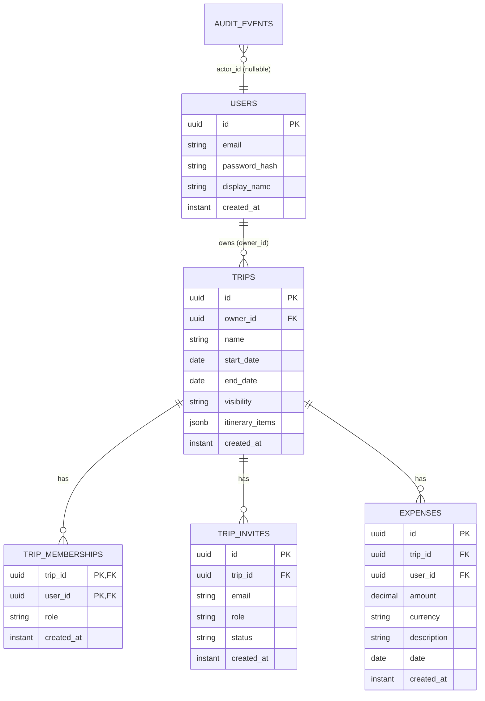

# Backend Component Walkthrough

## Document Metadata
- Status: Active backend architecture walkthrough
- Reviewed on: 2026-02-22
- Scope: Backend (`backend/**`)

## Package Map

## Component Responsibilities
- `domain.trip.Trip`:
  - enforces trip invariants, itinerary mutation logic, and role-based membership rules.
- `application.trip.*`:
  - orchestration/use-cases; delegates invariant checks to domain and persistence to repositories.
- `infrastructure.persistence.JpaTripRepository`:
  - maps aggregate to relational model (`trips`, `trip_memberships`, `trip_invites`) and emits audit events.
- `infrastructure.auth.*`:
  - token creation and request authentication context.
- `interfaces.rest.*`:
  - HTTP contract, request validation, and mapping to application services.

## Persistence Model

## API Surface (Backend)
- Auth:
  - `POST /auth/register`
  - `POST /auth/login`
  - `GET /auth/me`
- Trips:
  - `POST /trips`
  - `GET /trips`
  - `GET /trips/{id}`
  - `PUT /trips/{id}`
  - `DELETE /trips/{id}`
- Itinerary:
  - `GET /trips/{tripId}/itinerary/v2`
  - `POST /trips/{tripId}/itinerary/v2/items`
  - `PUT /trips/{tripId}/itinerary/v2/items/{itemId}`
  - `POST /trips/{tripId}/itinerary/v2/items/{itemId}/move`
  - `DELETE /trips/{tripId}/itinerary/v2/items/{itemId}`
- Expenses:
  - `POST /trips/{tripId}/expenses`
  - `GET /trips/{tripId}/expenses`
  - `PUT /trips/{tripId}/expenses/{expenseId}`
  - `DELETE /trips/{tripId}/expenses/{expenseId}`
- Collaboration:
  - `/trips/{tripId}/collaborators`, `/invites`, `/members`, role endpoints.
- Audit:
  - `GET /audit/events`

## Current Architectural Shape
- Strengths:
  - clear DDD-style package boundaries,
  - aggregate-level invariants are strongly encoded,
  - integration tests cover major user journeys.
- Main systemic weaknesses:
  - inconsistent authorization contract handling,
  - heavy repository-level write strategy for aggregate children,
  - repeated controller plumbing and repeated test helper logic.
